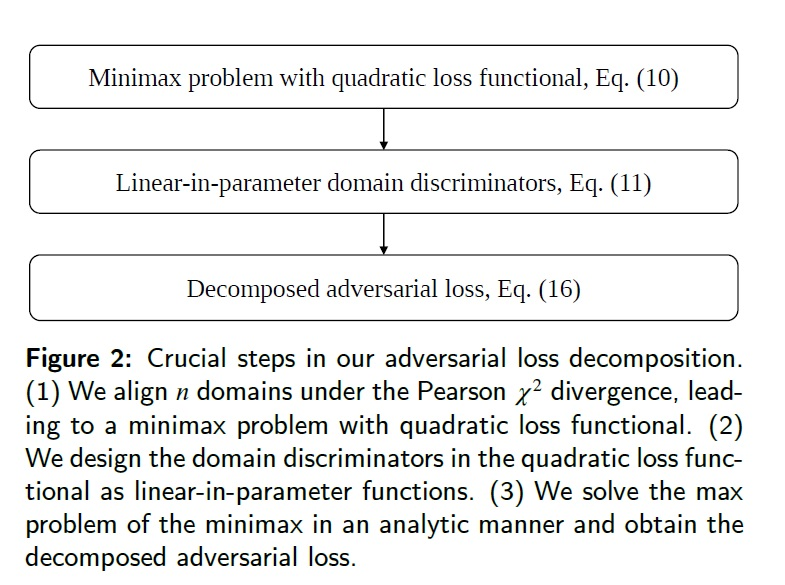
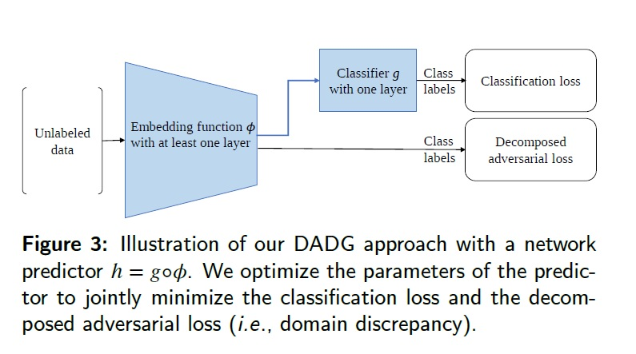

# Decomposed Adversarial Domain Generalization

This repository provides the Pytorch implementation for the work "Decomposed Adversarial Domain Generalization" published in Knowledge-Based Systems, 2023. 

In this work, we study the domain generalization problem, and propose the Decomposed Adversarial Domain Generalization (DADG) approach to addressing the problem.
Importantly, we show that under certain circumstances, the challenging adversarial minimax problem can be decomposed and converted into a simple and straightforward minimization problem (see Fig. 2). We believe that this could provide an interesting alternative to adversarial learning. The ultimate model of our approach is neat and simple, which is illustrated in Fig. 3.

For more details of this domain generalization approach, please refer to the following KBS work: 

@article{Chen2023Decomposed,  
  author={Sentao Chen},  
  journal={Knowledge-Based Systems},   
  title={Decomposed adversarial domain generalization},   
  year={2023},  
  volumn={263},  
  pages={110300},   
  issn = {0950-7051},  
  doi={https://doi.org/10.1016/j.knosys.2023.110300}   
  }
 
